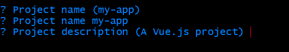
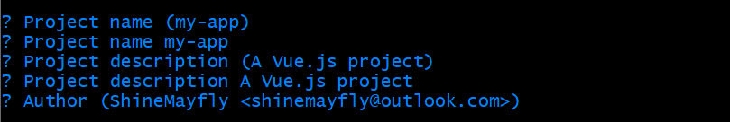
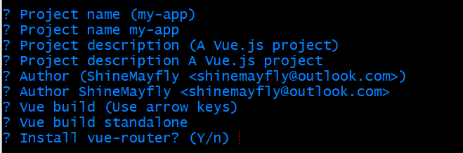
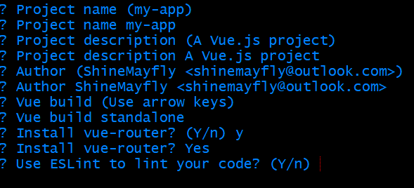
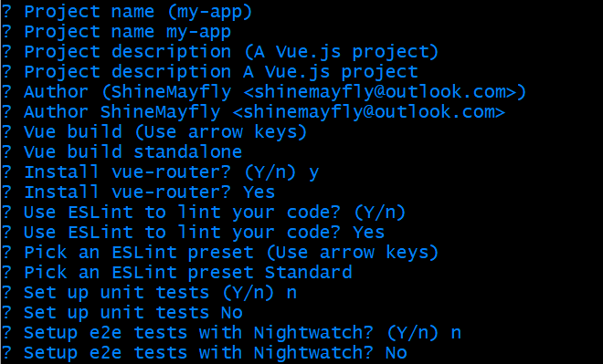
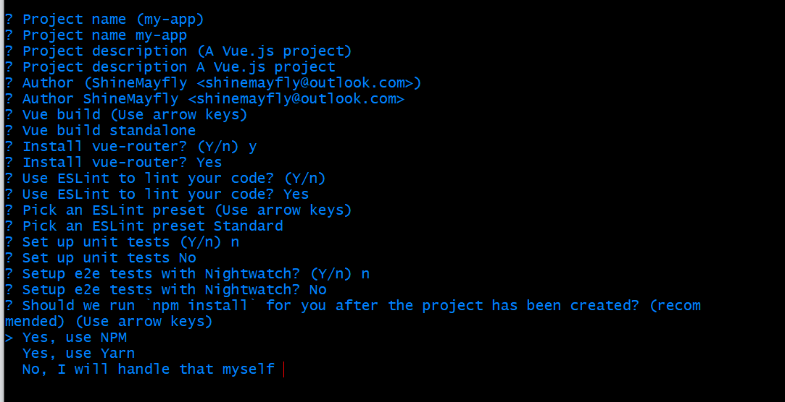
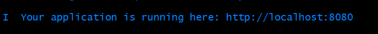

# Vue-CLI

### 1、使用vue-cli + webpack搭建vue开发环境


#### ①、环境要求

- [node](https://nodejs.org/zh-cn/)
- [webpack](https://www.webpackjs.com/)
- [vue-cli](https://cli.vuejs.org/zh/)

#### ②、安装环境

 node:

到 [node.js官网](https://nodejs.org/zh-cn/)下载最新的安装包安装

webpack:

```bash
$ npm install webpack
```

vue-cli:

```bash
$ npm install vue-cli -g
```

#### ③、创建vue项目

###### 创建项目

```bash
$ vue init webpack my-app(项目名)
```

###### 初始化项目

1、项目名称


不输入项目名称会默认刚刚输入的项目名，即括号内的名称

2、项目描述



不输入会默认括号内的描述

3、项目作者



不输入默认

4、vue-router



是否使用vue-router，这里选择Y使用

5、ESLint



是否使用ESLint,这里选择Y使用（可以选择不使用，之后再配置）

6、unit 和 e2e tests 



unit和e2e tests 这里选n不使用

7、安装依赖包



可以选择npm或yarn,也选择选no,之后自己安装

###### 运行项目

8、运行

先安装依赖包，如果之前已经安装好依赖包,现在可以直接使用命令行进入项目文件夹

```bash
$ cd my-app
$ npm run dev
```



当出现上面提示时，此时可以打开浏览器输入http://localhost:8080 查看项目

#### ④、简单配置

###### 1、修改favicon

将你的favicon.ico文件放到项目的static文件夹下

在index.html head里增加

```html
<link rel="shortcut icon" href="static/favicon.ico">
```

刷新网页，此时你的项目的favicon已经变成你的icon了。


###### 2、搭建mock server

需要用到[mock.js](http://mockjs.com/) 和 [axios](../Axios),可以到官网学习

安装依赖

```bash
$ npm install axios --save
$ npm install mockjs --save-dev
```

搭建web server

①、在项目根路径下创建mock文件夹,并创建图片中mock文件夹中的几个文件

```file
1、index.js
2、util.js
3、userInfo.json
```


②、index.js 文件

```js
const Mock = require('mockjs'); //mockjs 导入依赖模块
const util = require('./util'); //自定义工具模块
//返回一个函数
module.exports = function(app) {
    //监听http请求
    app.get('/user/userinfo', function(rep, res) {
        //每次响应请求时读取mock data的json文件
        //util.getJsonFile方法定义了如何读取json文件并解析成数据对象
        var json = util.getJsonFile('./userInfo.json');
        //将json传入 Mock.mock 方法中，生成的数据返回给浏览器
        res.json(Mock.mock(json));
    });
}
```

③、util.js 文件

```js
const fs = require('fs'); //引入文件系统模块
const path = require('path'); //引入path模块

module.exports = {
    //读取json文件
    getJsonFile: function(filePath) {
        //读取指定json文件
        var json = fs.readFileSync(path.resolve(__dirname, filePath), 'utf-8');
        //解析并返回
        return JSON.parse(json);
    }
};
```

④、userInfo.json 文件

```json
{
    "error":0,
    "data":{
        "userid": "@id()",//随机生成用户id
        "username": "@cname()",//随机生成中文名字
        "date": "@date()",//随机生成日期
        "avatar": "@image('200x200','red','#fff','avatar')",//生成图片
        "description": "@paragraph()",//描述
        "ip": "@ip()",//IP地址
        "email": "@email()"//email
    }
}
```

⑤、在路径build/webpack.dev.conf.js文件中的devServer属性中新添加一个before钩子函数,用来监听来自web的http请求。([关于devServer.before如何使用](https://www.webpackjs.com/configuration/dev-server/#devserver-before))

```js
devServer: {
    clientLogLevel: 'warning',
    historyApiFallback: {
        rewrites: [
            { from: /.*/, to: path.posix.join(config.dev.assetsPublicPath, 'index.html') },
        ],
    },
    hot: true,
    contentBase: false,
    compress: true,
    host: HOST || config.dev.host,
    port: PORT || config.dev.port,
    open: config.dev.autoOpenBrowser,
    overlay: config.dev.errorOverlay ?
        { warnings: false, errors: true } :
        false,
    publicPath: config.dev.assetsPublicPath,
    proxy: config.dev.proxyTable,
    quiet: true,
    before: require('../mock'), // 引入mock/index.js
    watchOptions: {
        poll: config.dev.poll,
    }
}
```

⑥、在App.vue文件中使用axios发起http请求

```vue
export default {
  name: 'App',
  data () {
    return {
      userInfo: {}
    }
  },
  created () {
    this.getUserInfo()
  },
  methods: {
    getUserInfo () {
      // 请求'/user/userinfo'接口
      this.axios.get('/user/userinfo')
        .then(({ data }) => {
          // 打印mock data
          console.log(data)
          if (data.error === 0) {
            this.userInfo = data.data
          } else {
            this.userInfo = {}
          }
        })
    }
  }
}

```

可以看到每次点击请求时会获取的随机生成的mock data。